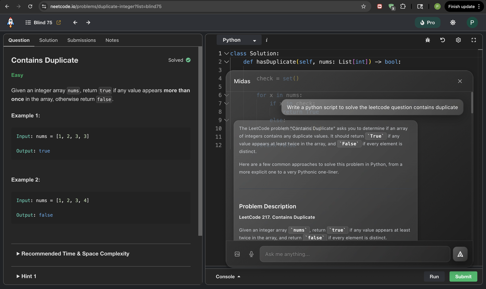

# Midas Assistant

Midas is a desktop assistant that you can access by clicking its icon on the bottom right of your screen. Once you click the icon you will be taken to a chat window (shown in the demo below). You can ask Midas simple questions, and it will retain a running memory of who you are and what you ask, along with a chat history! I plan to add MCP so that it can automate workflows, and I want to add nanobrowser to allow Midas to use the web. 

## Demo




## Setup

1. Install dependencies:
```bash
npm install
```

2. Run the application:
```bash
npm run dev
```

## Usage

- The floating icon appears in the bottom-right corner of your screen
- Drag the icon anywhere on your screen
- Click the icon to open the chat window
- Click the X button to close the chat window
- Click the icon to reopen the chat window (it will save your message so don't worry!)

## Tech Stack

- **Electron** - Desktop framework
- **React** - UI library
- **Vite** - Build tool
- **Tailwind CSS** - Styling

